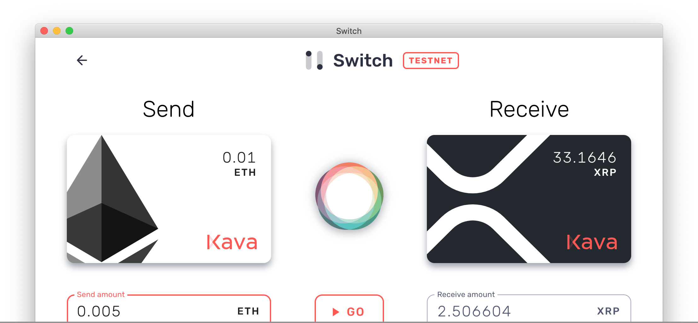
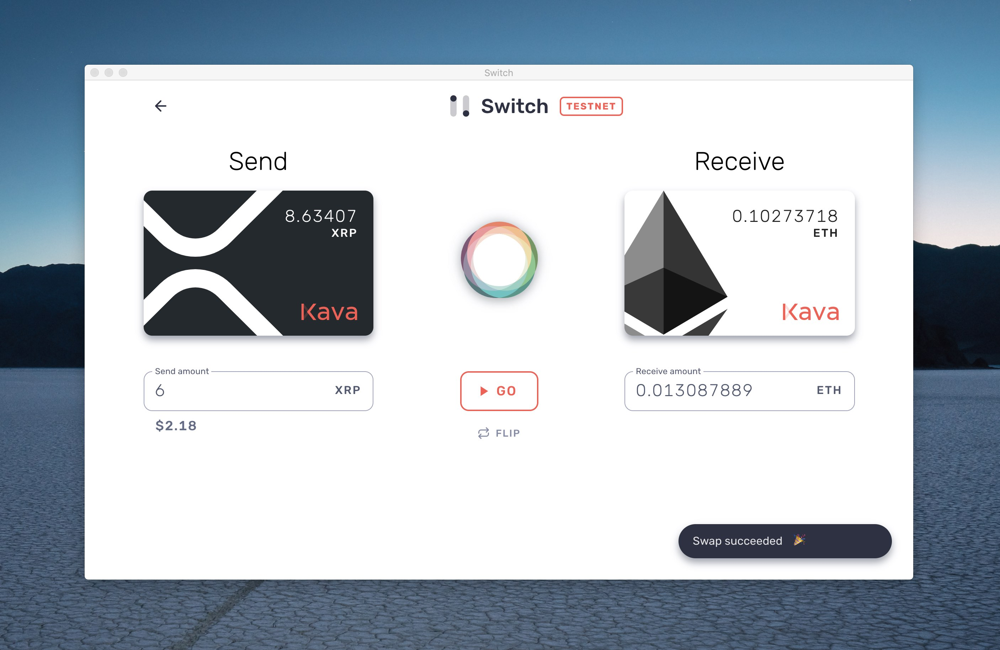

🏁 Swap crypto assets in seconds using Interledger 💸

<!---->

In Switch, you can create and load funds onto "cards" to swap between assets. Only you have access to these funds. Thanks to streaming micropayments, even while trading, you retain full asset custody!

# Get Started

 1) Download the latest testnet release for Mac, Windows, and Linux [here](https://github.com/Kava-Labs/switch/releases/latest).
    - To open Switch on mac, you'll need to right click and select open.

 2) Add a minimum of two cards. We suggest ETH and XRP to get started.
 
    - Add an Ethereum card using a private key. If you don't have a kovan account, get a private key and address from [this generator](https://vanity-eth.tk). Then load the address with testnet eth at [the Kovan testnet faucet](https://faucet.kovan.network/).
    - Add an XRP card using a xrp secret. If you don't have a test xrp account, get a prefunded testnet secret from [the XRP testnet faucet](https://developers.ripple.com/xrp-test-net-faucet.html).

 3) Click the cards and deposit some coins. Now you're funds are on layer 2!

 4) Click swap to exchange currencies.

# How It Works
## Fast Non-custodial Trading

When trading between assets, Switch will first send a very small amount of the source asset, the equivalent of $0.05, to the exchange party known as the connector. Then, the connector sends some amount of the destination asset. If the connector upholds its side of the bargain and the exchange rate it provides is decent, we repeat the process. And again. And again; many times per second.

This is the model of streaming micropayments: moving value bit-by-bit until the entire payment or trade is complete.

If at any point the connector stops sending or sends too little of the destination asset, we halt the exchange. This enables non-custodial trading, since the counterparty risk is merely a few cents.

Payment channels enable these payments to be cheap and fast.

Switch uses Kava as the default connector, but we will be expanding this to user-defined connectors in the near future.

## Links
 - [FAQs](./docs/faqs.md)
 - [Setup Swaps Over Lightning](./docs/lightning-setup.md)
 - [What is layer 2 and payment channels?](./docs/faqs.md#what-is-layer-2-and-payment-channels)
 - [What is interledger?](./docs/faqs.md#what-is-interledger)

## Developer Installation

    > git clone https://github.com/kava-labs/switch
    > cd switch
    > npm install
    > npm run serve

# Roadmap

- [x] Cards for the top three cryptocurrencies
- [x] Fast swaps
- [ ] Custom connectors
- [ ] Peer-to-peer payments
- [ ] Cards for ERC-20 tokens, such as Dai

# License
Copyright © Kava Labs, Inc. All rights reserved.

Licensed under the Apache v2 License.