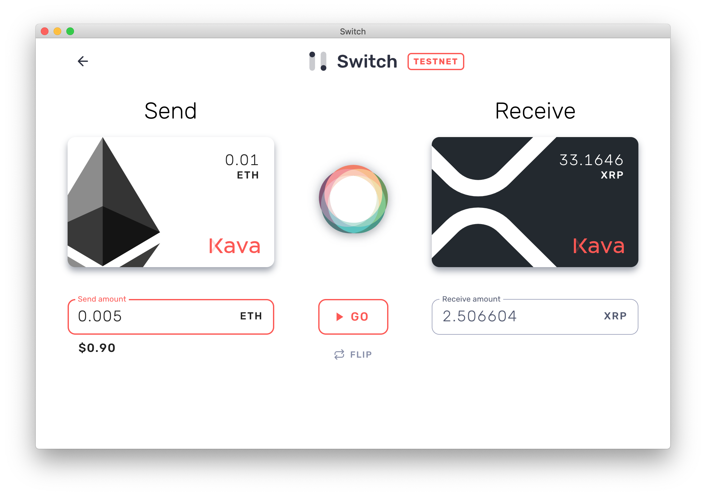

<b>
🏁 Swap crypto assets in seconds with Interledger | 🔒 Secure non-custodial trading | 💸 Onboarding to layer 2 networks
</b>

<!---->

In Switch, you can create and load funds onto "cards" to swap between assets. Only you have access to these funds. Thanks to streaming micropayments, even while trading, you retain full asset custody!

# Getting Started

 1) Download the latest testnet release for Mac, Windows, and Linux [here](https://github.com/Kava-Labs/switch/releases/latest).

 2) Add a minimum of two cards. We suggest ETH and XRP to get started.
 
    - Add an Ethereum card using a private key. If you don't have a kovan account, get a private key and address from [this generator](https://vanity-eth.tk). Then load the address with testnet eth at [the Kovan testnet faucet](https://faucet.kovan.network/).
    - Add an XRP card using a xrp secret. If you don't have a test xrp account, get a prefunded testnet secret from [the XRP testnet faucet](https://developers.ripple.com/xrp-test-net-faucet.html).

 3) Click the cards and deposit some coins. Now you're funds are on layer 2!

 4) Click swap to exchange currencies.

# How It Works
## Non-custodial Trading

When trading between assets, Switch will first send a very small amount of the source asset — the equivalent of $0.05, by default — to the connector. Then, the connector sends some amount of the destination asset. If the connector upholds its side of the bargain and the exchange rate it provides is decent, we repeat the process. And again. And again; many times per second.

This is the model of streaming micropayments: moving value bit-by-bit until the entire payment or trade is complete.

If at any point the connector stops sending or sends too little of the destination asset, we halt the exchange. This enables non-custodial trading, since the counterparty risk is merely a few cents.

Switch uses Kava as the default connector, but we hope to expand this to user-defined connectors in the near future.

## Setup Testnet Lightning
 1) [Download and setup Zap](https://github.com/LN-Zap/zap-desktop#install) on testnet.
    - You'll need to create or import a testnet wallet and get some testnet btc from the faucet (link provided in Zap).
 2) Create a channel to the Kava connector.
    - Find the manage channels page in Zap.
    - Click `create new channel` and search for the node named `kava-test-2`. Create a channel for more than you want to trade.
    - In the future, when the lightning network is more mature, this step won't be necessary.
 3) Create a lightning card in switch
    - Host will be `localhost`
    - Port is `11009` for Zap's lnd.
    - TslCert can be found in the data directory for Zap. The file needs to be base64 encoded. On mac this command will print it: `cat "~/Library/Application Support/Zap/lnd/bitcoin/testnet/<wallet name>/tls.cert" | base64`
    - Macaroon can also be found in the data directory for Zap. On mac this command will print it: `cat "~/Library/Application Support/Zap/lnd/bitcoin/testnet/<wallet name>/data/chain/bitcoin/testnet/admin.macaroon" | base64`
    - `<wallet-name>` should be replaced with the name of your wallet, usually "wallet-1".
<!--
## Links
 - [FAQs](./docs/faq.md)
 - [Understanding Layer 2]()
 - [What is interledger]()
 -->

# Developer Installation

    > git clone https://github.com/kava-labs/switch
    > cd switch
    > npm install
    > npm run serve

# Roadmap

- [x] Add top three currencies
- [x] Launch public beta
- [ ] Custom connectors
- [ ] Peer-to-peer payments
- [ ] Cards for ERC-20 tokens, such as Dai

# License
Copyright (c) Kava Labs, Inc. All rights reserved.

Licensed under the Apache v2 License.